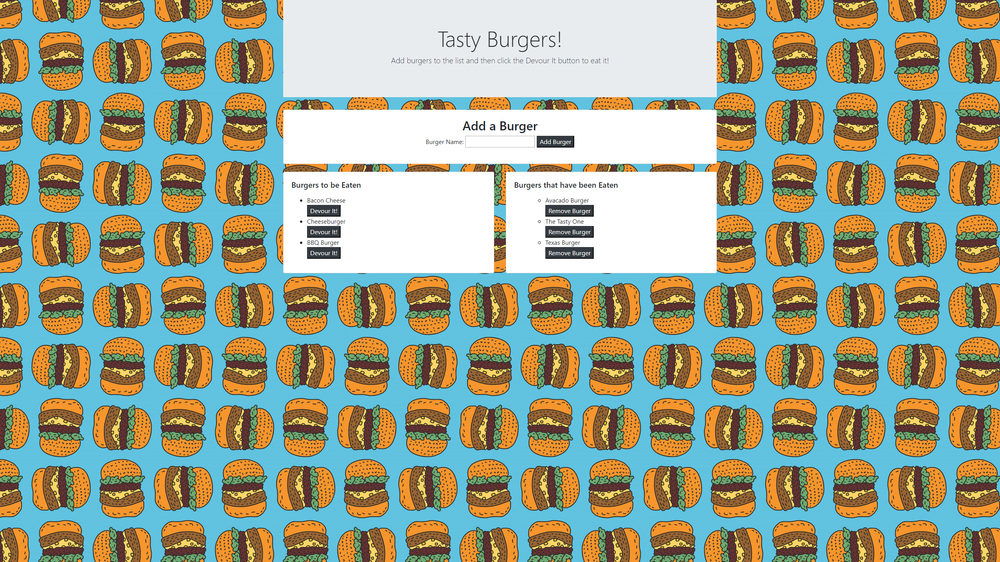

# Burger

## What does this app do?
This app allows the user to add burgers to a list that can be seen by anyone who visits the page. The user can choose to "devour" a burger and it will move to a different list of burgers that have been eaten. From there it can be removed from the page entirely. 

## About:
This app uses both front end and back end technologies and combines them for a full stack program.
Upon opening the page, a user will be able to see two lists of burgers as well as an area to add new ones. Everything seen is displayed to the user using handlebars. When the user adds another burger, the infomation is taken from the form and is posted to the MySQL database. The page is also updated at this time which allows the new entry to be shown on the first list of "not eaten burgers". Each of the burgers on the first list has a button that says devour next to it. When the button is clicked, information about that burger is updated based on its ID. Its boolean value of being devoured is changed from false to true and is then moved to the second list of "eaten burgers". The burgers on the second list also each have a button that allows the user to remove the burger from the list entirely. When clicked the burger is deleted from the database and can no longer be found on the page.  

## Try the app here:
https://vast-inlet-59888.herokuapp.com/

## Tools Used:
* Node
* Express
* MySQL
* javascript
* Handlebars
* npm
* jquery
* Bootstrap 
* Google Fonts
* Heroku